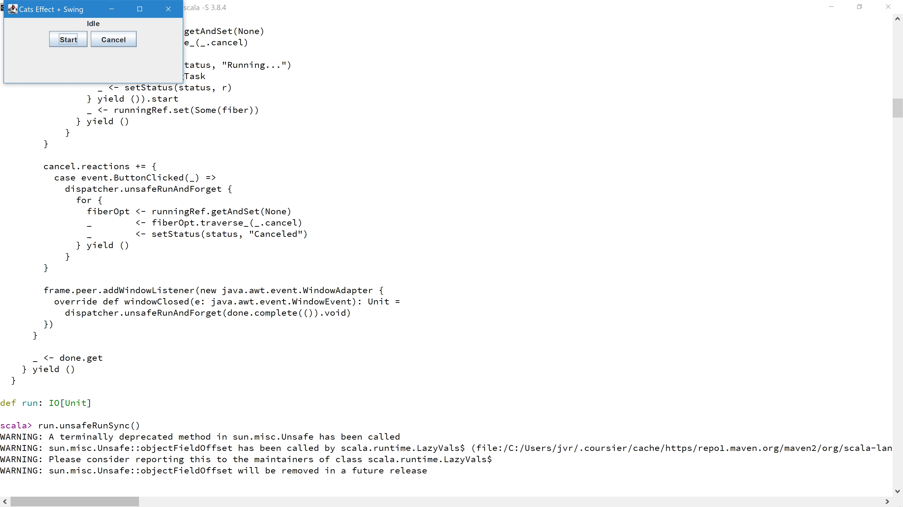

# sbt_console_select
    
##### Hint  
The code is loaded using the REPL "load: " command,
(except when using the "--load CE--" mode),  
which is more reliable (Scala 3.8.2+ required!).  
  
Included test file: "testREPL.scsc", "testReplCE.scsc" and "build.sbt"  
(Add a "project --> build.properties" file)  

##### Description  
 
Simple app to start "sbt console" or "sbt consoleQuick" (or GHCI) in different directories.  
[SBT](https://www.scala-sbt.org/) is a [Scala](https://www.scala-lang.org/) build tool,   
"sbt console" or "sbt consoleQuick" starts the Scala REPL,  
using additional information supplied by the SBT build system.  
Windows only, but can be used with the WSL.  
  
The app changes the Clipboard-content!  
  
Can be used to start any programm/app in a selectable directory.  
("sbt console" needs a ["build.sbt"-file](https://www.scala-sbt.org/1.x/docs/Basic-Def.html) in the running directory  
and the file "project\build.properties" with the SBT version information).  
  
**Sbt_console_select destroys the clipboard content!**
  
##### App status  

* Usable, but work in progress!  
* ~~Not usable with windows terminal~~

##### Download  
  
Portable, run from any directory, but running from a subdirectory of the windows programm-directories   
(C:\Program Files, C:\Program Files (x86) etc.)  
requires admin-rights and is not recommended! 

Via Updater (preferred method):  
   
Download Updater from Github to the previously created directory:  
[updater.exe 64bit](https://github.com/jvr-ks/sbt_console_select/raw/main/updater.exe)  
or  
[updater.exe 32bit](https://github.com/jvr-ks/sbt_console_select/raw/main/updater32.exe)  
  
[Viruscheck see Updater repository](https://github.com/jvr-ks/updater)  
   

or single files:  
64 bit:  
[sbt_console_select.exe](https://github.com/jvr-ks/sbt_console_select/raw/main/sbt_console_select.exe) 
or  
32 bit:   
[sbt_console_select32.exe](https://github.com/jvr-ks/sbt_console_select/raw/main/sbt_console_select32.exe)  

and:   
[sbt_console_select.ini](https://github.com/jvr-ks/sbt_console_select/raw/main/sbt_console_select.ini)   
[sbt_console_select.txt](https://github.com/jvr-ks/sbt_console_select/raw/main/sbt_console_select.txt)    
[sbt_console_select_shortcuts.txt](https://github.com/jvr-ks/sbt_console_select/raw/main/sbt_console_select_shortcuts.txt)   
  
<a href="#virusscan">Virus check see below.</a>
  
#### Hints  
* The REPL currently only support single line function parameter definitions, example:  
```
def test(
  a: Int,
  b: Int
) = println(a + b)
```
is valid Scala 3 code, but the REPL shows the error:  
```
-- [E040] Syntax Error: --------------------------------------------------------
1 |def test(
  |         ^
  |         an identifier expected, but eof found
```  
* sbt_console_select can only operate on console windows opened by itself!  
* To run in the background listening to API calls use "sbt_console_select.exe hidewindow"
* Select terminal type:  
  default: %comspec% (= cmd.exe),  
  "$WSL$" inside the name: wsl.exe,  
  "$WT$" inside the name: Windows Terminal ("wt.exe" must be included in the Windows Path!),  
* Last opened (by sbt_console_select) Console-Window is peferred over other Console-Windows running. 
* Can be used not only to start sbt, but many other tools, starts a %comspec% shell if command-field is emtpy.
* REPL Past mode is removed from SBT, use \{ ... \} instead!  
* Do not use "Aottext" to hold the code to execute.  
  Aottext aggressively grabs the focus so the command-windows does not get the focus! 
* **sbt_console_select.exe runs in the background after start! Use the hotkey \[ALT] + \[t] to show the app-window**
* [SBT](https://www.scala-sbt.org/) should be be installed to use it.  
* The *.default-files are used by the Updater.  
* Make sure that the names in the Command-file are exclusive, i.e. no other open window has it as a title not even as a part of it's title!  
  Names should NOT contain spaces! (Using the Rest-API names are part of an url and spaces must be replaced by "%20" then!)  
* Default Installation-directory that is suggested by "Updater" is "C:\jvrde\sbt_console_select",  
  but any writable directory can be used.  
* Does not use the JAVA_HOME(S) SBT mechanisnm.

#### Latest changes:  
Not commented/shown versions are bugfixes!  
  
Version (&gt;=)| Change
------------ | -------------  
0.266 | delayFastMode is default, new Metacommands
0.260 | Only block comments are removed (besides starting with "/\*\*" but are reserved to Metacommands)!
0.253 | Scala-cli support introduced
0.250 | Killswitch ESCAPE ("--load CE--" mode only)
0.248 | New replcommand "--load CE--" if the Scala REPL needs more time, i.e. code contains Cats Effect functional code  
0.247 | New hotkey to close Scala prompt and the console window: **\[CTRL] + \[ALT] + \[t]**
0.246 | Bugfixes
0.245 | Enterbutton usable to select list entry
0.237 | Select terminal type: default: %comspec%, "$WSL$" inside the name: wsl.exe, "$WT$" inside the name: Windows Terminal
0.233 | Changed the way the console title is set  
0.232 | Changed the temporary filenames to "replPart1.hs" / "replPart2.hs" (to be usable with GHCI)
0.229 | Title of WSL tabs
0.228 | replcommandsHotkey removed, replaced by auto load
0.228 | "\[replcommands]"-section replaced by the simple CSV value "config" - &gt; "replcommands=:reset, etc. ..."
0.225 | Please delete your "sbt_console_select.ini"-file, a new one (modified) will be created
0.220 | Bugfixes, open cmd-window mechanism changed
0.219 | Bugfixes: open/close with curl
0.218 | "// useImports=FILENAME" changed to: "/\*\* useImports=FILENAME \*/" \[importsFileName= and useImports= removed!]
0.217 | Given some extra time to close an already open shell-window  
0.216 | importsFileName=FILENAME changed to useImports=FILENAME
0.215 | imports mechanism changed 
0.214 | WSL support enhanced  
0.211 | "switch back to editor" is set to \[CTRL]-key again, not using the \[ALT]-key anymore  
 
  
\*1) send to console after "title", example: additionalCommand=chcp 65001  
  
#### Known issues / bugs  
  
Issue / Bug | Type | fixed in version  
------------ | ------------- | -------------  
Empty lines are not sent | bug | 0.260 
Sometimes a ":reset" instead of ":load ..." is sent | bug | --- 
Soft ":reset" does not reenable imports (--load imports--)| bug | 0.200   
Ctrl + E copies old contents | bug | 0.179   
    
##### Usage  
  
* Start sbt_console_select by a doubleclick onto the file "sbt_console_select.exe".  
or  
* drag the "sbt_console_select.exe" to the taskbar.  
or  
* create a shortcut of "sbt_console_select.exe" in the windows-autostart folder ("shell:startup")  
and add "hidewindow" as a parameter.  
Two powershell scripts included:  
"create_sbt_console_select_exe_link_hidewindow_in_autostartfolder.bat"
or  
to be used with the project [startdelayed](https://github.com/jvr-ks/startdelayed):  
"create_sbt_console_select_exe_link_hidewindow.bat"

or manually:   
-&gt; "sbt_console_select - Shortcut.lnk" -&gt; rightclick -&gt; properties -&gt; target -&gt; add "hidewindow" as a parameter,  
(and optional the Command-file and Config-file path),  
then start with the hotkey.  

Click an entry in the list to start the command as defined in the Command-file: "sbt_console_select.txt".  

##### Hotkey operations supplied by the app  
  
[Overview of all default Hotkeys used by my Autohotkey "tools"](https://github.com/jvr-ks/cmdlinedev/blob/main/hotkeys.md)  
  
The default Config-file is: "sbt_console_select.ini".  
  
Hotkeys are defined in the "\[config]"-section of the Config-file:  
  
* menuhotkey: **\[ALT] + \[t]** -&gt; open menu,    
* closeHotkey: **\[CTRL] + \[ALT] + \[t]** -&gt; sends \[CTRL] + \[d] and "exit",   
* exitHotkey: **\[SHIFT] + \[ALT] + \[t]** -&gt; sends \[CTRL] + \[d] and "exit",   

Hotkeys to be used in a text-editor:  
* replLoadSelectedHotkey: **\[CTRL] + \[e]**  
execute the seleted part of the code (as part 1) from the editor-page in the SBT-console-REPL.  
  
* replLoadHotkey: **\[ALT] + \[e]**  
execute the code (as part 1) of the editor-page in the SBT-console-REPL.   
    
* replSelectLoadPart2Hotkey: **\[SHIFT] + \[ALT] + \[e]**  
save the code as code part 2 or delete it (if nothing is seleted).  

##### Click modifiers  
  
* [CTRL] -&gt; open filemanager,  
  
##### Code execution  
  
Start a sbt-console window by selecting an entry.  
Entry names must be enclosed in parentheses and must not contain spaces!  
Then open your text-editor with the code to be executed with your editor and mark it,  
or mark any code elsewhere, i.e. in your browser.  
Press the replLoadHotkey, the code is executed in the SBT-console-REPL.  
Press the \[CTRL]-key to switch back to your editor.  
Holding down the \[CTRL]-key other commands can be emitted first, i.e. killing the REPL (\[CTRL] + [c]), copy text etc., auto-switching back afterwards.   
If your code execution needs two parts (if using a companion object),  
append the code part 2 surrounded by the comment (pseudocode) "/*\* code part 2 section" ... "*/" 
to your code:  
```
code part 1
...
/** code part 2 section  
code part 2
*/ 
```
(Saves the 2nd part also, position of code part 2 section doesn't matter).  
  
If you want to execute only the selected part of the code, press the replLoadSelectedHotkey (default: **\[CTRL] + \[e]**).   
To always execute a second part besides a seleted part, mark the second part (i.e. code part 2)  
and press the replSelectLoadPart2Hotkey: **\[SHIFT] + \[ALT] + \[e]** once.  
The second part is saved, so you must not always mark the code part 2 too.  
(Cleaned by the reset-hotkey (default is: \[CTRL] + r)).  
    
##### Code execution internals  
  
The Config-file section "\[config]" contains the definiton of the replcommands="..." as a CSV list.  
The replcommands are executed from left to right.  
There are 3 "pseudo"-commands defined internally:  
```  
--load the code part 1--  
```  
and  
```  
--load the code part 2-- 
```  
Pressing the replLoadHotkey or the replLoadSelectedHotkey, the code is saved to the temporary file "replPart1.hs".  
Pressing the replSelectLoadPart2Hotkey, the code is saved to the temporary file "replPart2.hs".
(Both inside the "sbt_console_select"-directory).  
If the command "--load the code part 1-- " is reached, the SBT-console-REPL ":load "sbt_console_select"-directory\replPart1.hs"  
is executed, likewise "--load the code part 2--" -&gt; ":load "sbt_console_select"-directory\replPart2.hs"
  
If your code uses Cats Effect use the "--load CE--" instead of "--load the code part 1--"    
in the Config-file section "\[config]" replcommands="..." or use a file "replcommands.txt" 
in the running directory containing: 
```
--load imports--,--load CE--   
```  
But "--load CE--" is also usable to run standard Scala code in the Scala 3 REPL.  
Main difference is: "--load CE--" mode uses the windows "postmessage" function to send  
the code to the REPL window which may be invisble (using "cmd.exe" console only),
while "--load the code part 1--" uses a function ("sendInput"),  
which sends into the keyboard buffer, using the "":load file" REPL command.  
  
In case of using "cmd.exe" console,  
all other instructions are now send via the "postmessage" function (v > 0.252).   
  
You may mix the "pseudo"-commands with other SBT-console-REPL-commands,   
Example:  

The "replcommands" default value is:
```  
replcommands="--load imports--,--load the code part 1--,--load the code part 2--" 
or  
replcommands="--load imports--,--load CE--
```  

File "imports.scsc" (in the running directory):  
``` 
// imports.scsc

import scala.language.postfixOps  
import scala.sys.process._  
```  
  
File "printHelper.scsc" (in the "running"-directory):  
```
// printHelper.scsc

object PrintHelper {
  implicit class Pr(val s: String | Int){
    def pr = {
      print(s)
      s
    }
  }
  implicit class Prl(val s: String | Int){
    def prl = {
      println(s)
      s
    }
  }
}

import PrintHelper._
```  
  
File "code.scsc" (in the "running"-directory):  
```
@main	def run(): Unit = {
  enum color {
    case red(alpha: Int)
    case green(alpha: Int)
    case blue(alpha: Int)
  }
  val a = color.red(128)
  a.toString.prl
  val green = color.green
  green.toString.prl
}

/** code part 2 section
run()
*/

// red(128)
// green
```
  
Drawback of the file/block load mechanism: Code is inserted as a block,  
you cannot reverse-navigate thru each line afterwards (Windows Terminal and WSL only). 
 
##### Scala-cli  
Windows only!
Scala-cli REPL uses an extra configuration file.  
If the start command is:"scala-cli repl repl-options.scala -S 3.8.2",  
the configuration file "repl-options.scala" must contain dependency definitions and  
may additionaly contain all import definitions *).  
*) \/\/> using options --repl-init-script "imports, all on a single line;...;..."  
or using an extra file containing the import definitions and including the repl command:  
\/\/** useImports=FILE *\/ in the code.  
  
Example:  
```
//> using dep org.typelevel::cats-effect:3.7.1
//> using dep org.typelevel::cats-core:2.13.0
//> using dep org.typelevel::cats-kernel:2.13.0

//> using dep org.scala-lang.modules::scala-swing::latest.release

//> using options --repl-init-script "import cats.effect._;import cats.effect.std.Dispatcher;import cats.effect.unsafe.implicits.global;import cats.syntax.all._;import scala.concurrent.duration._;import scala.swing._;import scala.swing.BorderPanel.Position._;"  
```
After running "scala-cli repl repl-options.scala -S 3.8.4"  
```
scala> :imports
import cats.effect._
import cats.effect.std.Dispatcher
import cats.effect.unsafe.implicits.global
import cats.syntax.all._

import scala.concurrent.duration._
import scala.swing._
import scala.swing.BorderPanel.Position._
```
Example running in the Scala-cli REPL:
```
//----------------------------- swing_REPL.scala -----------------------------
/**
//> using dep ...
are in the file "repl-options.scala"
*/

/** useImports=swing_REPL.imports */
def longRunningTask: IO[String] =
  IO.sleep(5.seconds) *> IO.pure("Done")

def setStatus(label: Label, text: String): IO[Unit] =
  IO(label.text = text)

def run: IO[Unit] =
  Dispatcher.parallel[IO].use { dispatcher =>
    for {
      runningRef <- Ref.of[IO, Option[Fiber[IO, Throwable, Unit]]](None)
      done       <- Deferred[IO, Unit]

      _ <- IO {
        val status = new Label("Idle")
        val start  = new Button("Start")
        val cancel = new Button("Cancel")

        val frame = new MainFrame {
          title = "Cats Effect + Swing"
          contents = new BorderPanel {
            add(status, North)
            add(new FlowPanel(start, cancel), Center)
          }
          size = new Dimension(300, 140)
        }

        frame.visible = true

        start.reactions += {
          case event.ButtonClicked(_) =>
            dispatcher.unsafeRunAndForget {
              for {
                old <- runningRef.getAndSet(None)
                _   <- old.traverse_(_.cancel)
                fiber <- (for {
                  _ <- setStatus(status, "Running...")
                  r <- longRunningTask
                  _ <- setStatus(status, r)
                } yield ()).start
                _ <- runningRef.set(Some(fiber))
              } yield ()
            }
        }

        cancel.reactions += {
          case event.ButtonClicked(_) =>
            dispatcher.unsafeRunAndForget {
              for {
                fiberOpt <- runningRef.getAndSet(None)
                _        <- fiberOpt.traverse_(_.cancel)
                _        <- setStatus(status, "Canceled")
              } yield ()
            }
        }

        frame.peer.addWindowListener(new java.awt.event.WindowAdapter {
          override def windowClosed(e: java.awt.event.WindowEvent): Unit =
            dispatcher.unsafeRunAndForget(done.complete(()).void)
        })
      }

      _ <- done.get
    } yield ()
  }

run.unsafeRunSync()

```

  
Hints:  
- Configuration File "sbt_console_select.ini",  
- If using 4 indentation set Configuration File section "config" -> "indent4=1", 
- To turn off timing display set Configuration File section "config" -> "showWait=0",  
- Canceling will cancel the REPL also,  
- Keep the REPL window in the forground while running,  
- If the REPL fails add an empty line to add extra time (delayLinesDefault=500)  (500 milliseconds),  
- \/\* Comments are suppressed. \*\/,  
- \/\*\* Comments are not suppressed. \*\/.  
- Newline problem: Each section of code needs some time to be processed by the REPL.  
  If you send the next section of code while the REPL is still processing,  
  the code gets lost.  
  You have to wait until the REPL has finished after each section!  
  But I found no simple way to detect the end of a code section,  
  i.e. a blank line may signal the code section end or may signal nothing,  
  but make the code more readable.  
  Another problem is how to estimated the amount of time to wait the REPL needs to process the code section,  
  which depends on the CPU capability too!
  Sbt-console-select uses a very simple mechanism to determine the waiting time,  
  which is not very reliable!  
   
##### replcommands auto overload  
Besides changing the config-file,  
you can create a file "replcommands.txt" in the running directory (NOT the "sbt_console_select.exe"-directory).  
Example file "replcommands.txt" content (a CSV list) is:  
```
:reset,--load imports--,:imports,--load the code part 1--,--load the code part 2--
```  
or only:
```
--load imports--,--load CE--  
```

The content of the "replcommands.txt" will be used instead of the config-file -&gt;  replcommands="...". definition,  
so after running the code all defined imports will be listed.  
  
The "replcommands.txt" content is NOT copied to the config-file!   

Hint: "--load imports--,:imports" loads the imports and shows them.
The imports must be defined using a command like "\/\*\* useImports=fs2Imports.sctxt \*\/"
inside the code file!
  
##### Imports mechanism  
To load an import-file insert a comment like "/\*\* useImports=FILENAME \*/" into your code,  
example: /\*\* useImports=imports1.scsc \*/
Upon reaching the "replcommandN=--load imports--" command, the file is loaded, i.e.  
:load FILENAME  
is executed.  
It must always be the first line of the code!  
  
##### "--load CE--" mode  (Windows only!)  
Does not use the REPL "load: ..." command" (besides loading the imports if "useImports=" is used)  
but sends the code via the Windows "postmessage" command,  
which has some benefits:  
- Getting more information from the REPL,  
- Interactive REPL operations like replace single functions etc.,  
- The REPL history is usable.  
  
but some drawbacks also:  
- it's very slow!  

Metacommands defined:  
```
/** useImports=<FILENAME> */  
/** delay=<NUMVALUE> */ [NUMVALUE are microseconds]
/** showmessage<NUMVALUE>=<MESSAGE> */ [NUMVALUE are microseconds: time the message is shown]
/** replRestart */ -> restarts the last startcmd (Command column), if the REPL has closed

```
Metacommand Examples:
```
/** useImports=swing_REPL.imports */  
/** delay=10000 */ -> a 10 seconds delay  
/** showmessage5000=Closing the gui will kill the REPL, use UP key + Enter to restart the REPL! */  
-> message display duration is 5 seconds  
/** replRestart */ -> sends "scala-cli repl repl-options.scala -S 3.8.4"  

```

   
The REPL fails, if it has not enough time to calculate the code (especially functional code),  
so the time given to the REPL is estimated by "sbt_console_select",  
depending on the type of each codeline.  
(Under construction, configuration file -> section "delay").  
   
Put any Companion Class and Object into curly braces \{ ... \} !  
  
If the REPL cannot determine if the code is complete,  
you have to press an extra \[ENTER\] at the end of the code.  
Example:  
``` 
def test() =
  println("test")
  println(999)
```  
// The REPL cannot determine, if some code will follow or not, so it will wait endless!  
Pressing \[ENTER\] shows:
```
def test(): Unit
```
otherwise:
```
def test() =
  println("test")
  println(999)
  
test()
```
Will run the function "test" immediately.  

Example (Scala-cli REPL):  
```
/* 
// deps are included in file in "repl-options.scala"
// scala-cli repl repl-options.scala -S 3.8.4

// "repl-options.scala":
//> using dep org.typelevel::cats-effect:3.7.1
//> using dep org.typelevel::cats-core:2.13.0
//> using dep org.typelevel::cats-kernel:2.13.0

//> using dep com.lihaoyi::os-lib:0.11.9-M7
//> using dep com.lihaoyi::fansi:0.5.1

//> using dep org.legogroup::woof-core:0.9.0 */

import cats.effect.IO
import org.legogroup.woof.{given, *}
import org.legogroup.woof.Logger.given_Printer
import cats.effect.unsafe.implicits.global


val consoleOutput: Output[IO] = new Output[IO]:
  def output(str: String)      = IO.delay(println(str))
  def outputError(str: String) = output(str) // MDOC ignores stderr

given Filter = Filter.everything
given Printer = NoColorPrinter()

def program(using Logger[IO]): IO[Unit] = 
  for
    _ <- Logger[IO].debug("This is some debug")
    _ <- Logger[IO].info("HEY!")
    _ <- Logger[IO].warn("I'm warning you")
    _ <- Logger[IO].error("I give up")
  yield ()

val main: IO[Unit] = 
  for
    given Logger[IO]  <- DefaultLogger.makeIo(consoleOutput)
    _                 <- program
  yield ()


main.unsafeRunSync()

// 2026-08-15 16:07:56 [DEBUG] rs$line$7$: This is some debug (rs$line$7:3)
// 2026-08-15 16:07:56 [INFO ] rs$line$7$: HEY! (rs$line$7:4)
// 2026-08-15 16:07:56 [WARN ] rs$line$7$: I'm warning you (rs$line$7:5)
// 2026-08-15 16:07:57 [ERROR] rs$line$7$: I give up (rs$line$7:6)
```

#### Using Cats-effect with "--load CE--" mode
Remember:  
- You cannot use "IOApp" and packages in the REPL!  
- Keyboard input like "Console[IO].readLine" randomly blocks!  
  
Instead:   
- add "import cats.effect.unsafe.implicits.global"  
- add "import scala.concurrent.duration.DurationInt"  
- replace "def run(args: List[String])" by "val run: IO[ExitCode] ="  

To execute use:  
run.timeoutTo(10.seconds,IO.println("Stopping after 10 seconds").as(ExitCode.Success)).unsafeRunSync()  
or something likewise.  

Killswitch: 
During "--load CE--" mode action, the killswitch (ESCAPE key) ist activated.  
If the REPL console crashes "sbt_console_select" may send the code commands to the next open window.  
To stop it immediatedly press the ESCAPE key!  
TO stop just the data transfer press Shift+ESCAPE!  

##### Configuration setup: 
``` 
[config]
delayFastMode=1  // 1 = yes

[delays]
delayEachCharacter=12 // not used in FastMode
delayEachLine=500
delaySection=6000     // delay after a code section
delaySectionInc=100   // each codeline adds this delay to delaySection
``` 
  
Example:  
````
import cats.effect.unsafe.implicits.global

import cats.effect.*
import cats.syntax.all.*

import cats.effect.{IO, IOApp}
import cats.effect.std.Console

import scala.concurrent.duration.*
import io.AnsiColor.*
import cats.implicits.*


val run =
  for
  _ <- IO.print(fansi.Color.LightRed("Hello "))
  _ <- IO.println(fansi.Color.LightBlue("world!"))
  _ <- IO.println("")
  _ <- IO.println("TEST")
  _ <- cats.effect.std.Console[IO].println("TEST")
  _ <- IO.println(fansi.Color.LightGreen("Please press ENTER key to quit!"))
  _ <- Console[IO].readLine
  _ <- IO.println(fansi.Color.Black("byby ..."))
  _ <- IO.println("")
  
  yield cats.effect.ExitCode.Success
  
run.unsafeRunSync()
````

##### Cats-effect example  
Using the files:  
"replcommands.txt":  
```

--load imports--,:imports,--load CE--
```

"swing_REPL.imports":  
  
```
import cats.effect._
import cats.effect.std.Dispatcher
import cats.effect.unsafe.implicits.global
import cats.syntax.all._

import scala.concurrent.duration._
import scala.swing._
import scala.swing.BorderPanel.Position._
  
```
"swing_REPL.options":
  
```
//> using dep org.typelevel::cats-effect:3.7.1
//> using dep org.typelevel::cats-core:2.13.0
//> using dep org.typelevel::cats-kernel:2.13.0

//> using dep org.scala-lang.modules::scala-swing::latest.release

```
  
"swing_REPL.scala":
  
```
/** useImports=swing_REPL.imports */
def longRunningTask: IO[String] =
  IO.sleep(5.seconds) *> IO.pure("Done")

def setStatus(label: Label, text: String): IO[Unit] =
  IO(label.text = text)

def run: IO[Unit] = {
  Dispatcher.parallel[IO].use { dispatcher =>
    for {
      runningRef <- Ref.of[IO, Option[Fiber[IO, Throwable, Unit]]](None)
      done       <- Deferred[IO, Unit]

      _ <- IO {
        val status = new Label("Idle")
        val start  = new Button("Start")
        val cancel = new Button("Cancel")

        val frame = new MainFrame {
          title = "Cats Effect + Swing"
          contents = new BorderPanel {
            add(status, North)
            add(new FlowPanel(start, cancel), Center)
          }
          size = new Dimension(300, 140)
        }

        frame.visible = true

        start.reactions += {
          case event.ButtonClicked(_) =>
            dispatcher.unsafeRunAndForget {
              for {
                old <- runningRef.getAndSet(None)
                _   <- old.traverse_(_.cancel)
                fiber <- (for {
                  _ <- setStatus(status, "Running...")
                  r <- longRunningTask
                  _ <- setStatus(status, r)
                } yield ()).start
                _ <- runningRef.set(Some(fiber))
              } yield ()
            }
        }

        cancel.reactions += {
          case event.ButtonClicked(_) =>
            dispatcher.unsafeRunAndForget {
              for {
                fiberOpt <- runningRef.getAndSet(None)
                _        <- fiberOpt.traverse_(_.cancel)
                _        <- setStatus(status, "Canceled")
              } yield ()
            }
        }

        frame.peer.addWindowListener(new java.awt.event.WindowAdapter {
          override def windowClosed(e: java.awt.event.WindowEvent): Unit =
            dispatcher.unsafeRunAndForget(done.complete(()).void)
        })
      }

      _ <- done.get
    } yield ()
  }
}

/** delay=10000 */

run.unsafeRunSync()

/** showmessage15000=Closing the gui will kill the REPL, use UP key + Enter to restart the REPL! */
  
```
   
##### Setting Java and Scala versions  

Use [Selja](https://github.com/jvr-ks/selja) and [Selsca](https://github.com/jvr-ks/selsca) to set the approbiate versions.  
Using SBT:   
Scala-version: SBT uses the definition in the file "build.sbt"  
  
##### Configure "sbt_console_select":  

* Click on \[Edit] -&gt; \[Edit Command-file], edit the last line ", sbt -sbt-version 1.5.4 consoleQuick,graalvm11_203", replace "graalvm11_203" with your just configured Java/JDK name, save, close editor  
(-sbt-version 1.5.4 is added because there is not "project/build.properties"-file yet (is created then),  
the path is not set, so using the actual path of the "sbt_console_select.exe")    
  
##### Start REPL

(SBT must be installed!) 
* Using included files "build.sbt" and "scalafxTest2.sc" which is [based on https://github.com/scalafx/scalafx/blob/main/scalafx-demos/src/main/scala/scalafx/ColorfulCircles.scala](https://github.com/scalafx/scalafx/blob/main/scalafx-demos/src/main/scala/scalafx/ColorfulCircles.scala)
* Type \[Alt] + \[t] to reopen sbt_console_select
* Click on the last entry, sbt consoleQuick is started  
* It takes a moment to start the REPL, (using included file "built.sbt") 
* Type ":load scalafxTest2.sc"  
* After closing the demo, type \[Shift] + \[Alt] + \[t] to close the REPL (sends \[Ctrl] + \[D] and "exit")
* For ScalaFX us \[Ctrl] + \[D] then \[Arrow Up] then ":load scalafxTest2.sc" to restart

##### Executable  

* "sbt_console_select.exe"  
* "sbt_console_select.exe" &lt;Command-file&gt; &lt;Config-file&gt; &lt;hidewindow&gt; &lt;remove&gt;   
 
&lt;Command-file&gt;, &lt;Config-file&gt; see below
&lt;hidewindow&gt; = the word "hidewindow" 
&lt;remove&gt; = the word "remove" , remove app from memory (to compile a new one)  
  
##### Command parameter
Any command can have additional command-parameter, separated by a "#".  
Command-parameter text is send to the console-window using the clipboard and a \[Shift-right] click.  
  
The A messagebox is shown before sending.  
  
There are hardcoded Command-parameter with special functionality:  
* "+close+" : send "\[CTRL + D]" and "exit"  
  

##### Configuration  

* Config-file, default is "sbt_console_select.ini",  
contains name=value pairs,  
divided by different \[sections].
Currently:  
- Hotkey definitions  
- Path to Notepad\++, emailapp and filemanager. 
   
The Config-file **must** have the extension *.ini  
  
Only simple Hotkey modifications are reflected in the menu.  
(Parsing is limited to \[CTRL], \[ALT], \[WIN], \[SHIFT]).  
  
  
##### Startparameter / Autostart  

Startparameter |  action
------------ | ------------- 
hidewindow | start app in the background  
Command-number: 1 or 2 ... N | autostart this command (app stays in the background afterwards)
Config-file | must have extension ".ini"
Command-file | must have extension ".txt"
remove | removes app from memory

##### Rest Api
Seleting an entry via the commandline (besides manual selection) takes time because the app must be restarted.  
From version 0.188 the app is listening on port scsRestPort (Config-file -&gt; \[setup], 65505 is default), path: "scs".  
Known commands:  
* open=[entryname]   
* close=[entryname]  

Check if the port is not used by another application (Windows user may use "NetStat.exe").  
   
Example using "curl":  
curl http://localhost:65505/scs?open=(testareaQuick)  
Starts the entry named "(testareaQuick)".  
Instead of curl any browser is usable too. 
  
Use a batch-file like "curl_open.bat":  
curl http://localhost:65505/scs?open=(testareaQuick) 

curl http://localhost:65505/scs?close=(testareaQuick) 
Sends Ctrl-D (closes the REPL) and "exit" to the console window named (title contains with) "testareaQuick". 
  
To stop sbt_console_select from listening to the port the command-line parameter "restapioff" may be used,  
or an entry in the Config-file -&gt; \[setup] -&gt; restapioff=1.  
  
##### WSL [(Windows Subsystem for Linux)](https://docs.microsoft.com/en-us/windows/wsl/install)  
  
Instead of a Windows-console window, a WSL shell can be openend (if WSL is installed!).  
If the name (first clumn) contains "$WSL$" at any position, WSL is used.  
The path in the Command-file should be kept in Windows-format,  
the file "replcommands.txt" is read from the Windows-side
  
##### Using Haskell GHCI (with WSL) instead of SBT console  
  
Changes made to make the usage of Haskell GHCI possible are:  
* the filename-extension of the temporary files changed from ".tmp", to ".hs",  
SBT doesn't care about the changed temporary filenames.  
* a specialized "replcommands.txt"-file must be used, containing only commands known by GHCI:
* * "--load the code part 1--" -&gt; :load ...replPart1.hs
* * "--load the code part 2--" -&gt; :load ...replPart2.hs
* * "--load imports--" -&gt; not yet tested, I'm completely new to Haskell at the moment (2023/08)!
  
Sbt-console-select does not convert the temporary files to Linux line endings in case of using WSL,  
but neither SBT nor GHCI had a problem with the Windows line endings.  
    
##### Sourcecode: [Autohotkey format](https://www.autohotkey.com)  

* "sbt_console_select.ahk".  
  
##### Requirements  

* Windows 10 or later only.  
* Installed [SBT](https://www.scala-sbt.org/)  
* Portable app, nothing to install. 
  
##### Sourcecode  

Github URL [github](https://github.com/jvr-ks/sbt_console_select).  

  
##### License: MIT  

Permission is hereby granted, free of charge, to any person obtaining a copy of this software and associated documentation files (the "Software"), to deal in the Software without restriction, including without limitation the rights to use, copy, modify, merge, publish, distribute, sub-license, and/or sell copies of the Software, and to permit persons to whom the Software is furnished to do so, subject to the following conditions:

The above copyright notice and this permission notice shall be included in all copies or substantial portions of the Software.

THE SOFTWARE IS PROVIDED "AS IS", WITHOUT WARRANTY OF ANY KIND, EXPRESS OR IMPLIED, INCLUDING BUT NOT LIMITED TO THE WARRANTIES OF MERCHANT-ABILITY, FITNESS FOR A PARTICULAR PURPOSE AND NON-INFRINGEMENT. IN NO EVENT SHALL THE AUTHORS OR COPYRIGHT HOLDERS BE LIABLE FOR ANY CLAIM, DAMAGES OR OTHER LIABILITY, WHETHER IN AN ACTION OF CONTRACT, TORT OR OTHERWISE, ARISING FROM, OUT OF OR IN CONNECTION WITH THE SOFTWARE OR THE USE OR OTHER DEALINGS IN THE SOFTWARE.  
  
Copyright (c) 2020/2021 J. v. Roos  

<a name="virusscan">


##### Virusscan at Virustotal 
[Virusscan at Virustotal, sbt_console_select.exe 64bit-exe, Check here](https://www.virustotal.com/gui/url/49443150327609bc525844b98df3d7a1209509a268a6257ef86eec1ea02925fd/detection/u-49443150327609bc525844b98df3d7a1209509a268a6257ef86eec1ea02925fd-1787656707
)  
[Virusscan at Virustotal, sbt_console_select32.exe 32bit-exe, Check here](https://www.virustotal.com/gui/url/9e1af3ef4725ebfa06160e20caba2e9c3b89036eab3cb5cdec93e3181485a2b9/detection/u-9e1af3ef4725ebfa06160e20caba2e9c3b89036eab3cb5cdec93e3181485a2b9-1787656708
)  
Use [CTRL] + Click to open in a new window! 
